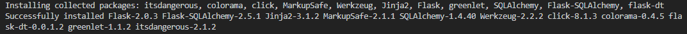
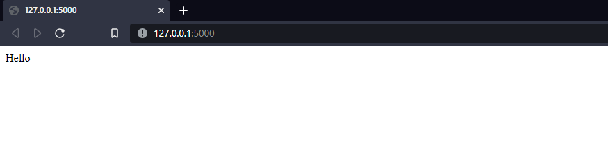
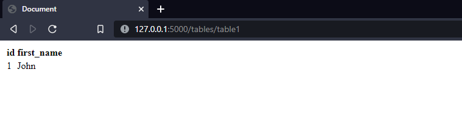
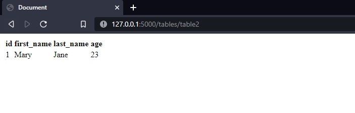

# Welcome To Flask Dt

Here we are going to build a simple flask application to utilise flask-dt

First of first is to install the package

```bash
$ pip install flask-dt
```

Below are notable versions of packages flask-dt requires


Now onto the directories

In the current project directory, the only sub-directory needed is the templates directory which will hold your template files just like any normal flask application would require.
Make sure to have created it

Create it manually or you can use the command as below
```bash
$ mkdir templates
```

Now onto the files

In the current project directory, a python file of any name
```bash
$ touch app.py
```

In the templates directory, a html file of any name  
This will display any of the tables in your db
```bash
$ touch display.html
```

Python file

Import the required packages to your file as below
```python
from flask import Flask
from flask_sqlalchemy import SQLAlchemy
from flask_dt import FlaskDt
```

Create your flask application with basic configurations
Using sqlite as the rdbms is an arbitrary choice for simplicity

```python
app = Flask(__name__)
app.config['SQLALCHEMY_DATABASE_URI'] = 'sqlite:///test.db'
app.config['SQLALCHEMY_TRACK_MODIFICATIONS'] = False
```

Create your database SQLAlchemy instance
```python
db = SQLAlchemy(app)
```

You can now create a FlaskDt instance as below
```python

dt = FlaskDt(db)

```
The FlaskDt instance needs the following arguments  
- The SQLAlchemy database instance
    - In this case it has the name db

Create a simple table to see flask-dt in action!  
Here we will use flask's ORM feature to define two tables

```python
class Table1(db.Model):
    id = db.Column(db.Integer, primary_key=True)
    first_name = db.Column(db.String(20), nullable=False)


class Table2(db.Model):
    id = db.Column(db.Integer, primary_key=True)
    first_name = db.Column(db.String(20), nullable=False)
    last_name = db.Column(db.String(20), nullable=False)
    age = db.Column(db.Integer, nullable=False)
```

Create a simple route for the home page
```python
@app.route('/home')
@app.route('/')
def home_page():
    return "Hello"
```

Create a route to display the tables
```python
@app.route('/tables/<string:tablename>')
# @login_required
@dt.display_table
def table_page(**kwargs):
    tablename = kwargs.get('tablename', None)
    table_class = kwargs.get('table_class', None)
    columns = kwargs.get('columns', None)
    records = kwargs.get('records', None)

    if table_class:        
        return render_template('display.html', columns=columns, records=records, tablename=tablename)

    else:
        return f'No such table {tablename} in the database. Try creating the table'
```
This serves to handle the routes to any of the tables in your db 

- Note the @dt.display_table decorator for the route
- Note the string variable named **tablename** in the route. The decorator will be looking for the given variable name on execution
- Note the commented @login.required decorator indicating you can chain decorators with dt too

A simple prompt will appear for an invalid table name  
We will create the tables in the db shortly  

Finally running the app
```python
if __name__ == "__main__":
    app.run(debug=True)
```

The final python file is in the repository

## creating the tables
We summon the python shell in the terminal as follows
```bash
$ python
```

We import the db instance then create the tables
```bash
>>>from app import db
>>>db.create_all()
>>>
```

We can add sample data to the tables created
```bash
>>>from app import Table1, Table2
>>>record1 = Table1(first_name="John")
>>>db.session.add(record1)
>>>db.session.commit()
>>>record2 = Table2(first_name="Mary", last_name="Jane", age=23)
>>>db.session.add(record2)
>>>db.session.commit()
>>>exit()
```

We now run the python file named app in the terminal
```bash
$ python app.py
    * Running on http://127.0.0.1:5000/ (Press CTRL+C to quit)
```


The home page should look like this


Now we head to the route using the following format
    - /route/tablename

The first table should look like this


The second table should look like this



## Something to Note
The dt decorator passes the following variables to your function
    - records
        - this is a list of all records in the db where each record is a dict
    - columns
        - this is a list of all columns in  the db
    - tablename
        - this is, ofcourse, the name of your table
    - table_class
        - this is the SQLAlchemy instance of your table

With that a simple for loop can be used to display all the records in the table as below
```html
    <table class="content-table">
            <thead>
                <tr>
                    
                    <th>{{column}}</th>
                    
                </tr>
            </thead>
            <tbody>

                
                <tr>
                    
                    <td>{{record.column}}</td>
                    
                </tr>
                
            
            </tbody>
    </table>
```

It would be amazing to know all your experiences with flask-dt. Projects accomplished, ideas regarding the package, improvement suggestions, basically anything and everything.

Enjoy!
